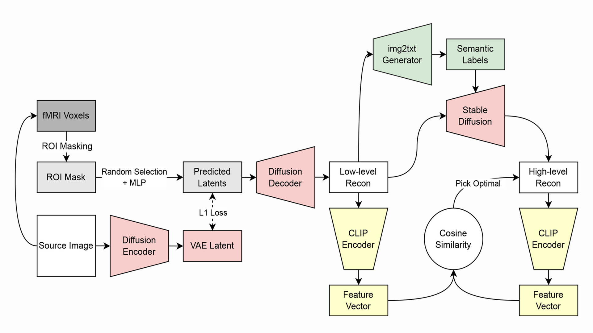

# 2023 Machine Learning Final Project

## Introduction

In this project, we aim to transform fMRI vetcors into images that the subject was looking at.

We build this model by VAE, BLIP, Stable Diffusion and CLIP.

## Architecture



> The architecture of our model.


Our model architecture has three parts
- Low-level Pipeline
- Guided Reconstruction Pipeline
- CLIP Voting Pipeline

From Low-level Pipeline, we can retreive low-level feature by making fMRI vectors transformed to VAE latents.

After get the low-level images, we then generate high level image by Diffusion(Guided Reconstruction Pipeline). This pipeline including prompts generation by BLIP and generate images by Stable Diffusion.

We train several models base on the architecture described above, then use bagging technich on those models. Calculate similarity by projecting images to CLIP space, then calculating the Cosine Similarity.

Finally, we get the result generate by our model.

## Dataset

From TA, a subset of NSD dataset.

There are 8 subjects' data within this dataset. For each subject, we have fMRI data and corresponding images.

> [Google Drive Link to Dataset](https://drive.google.com/drive/folders/1KQXGIKlS9nu6mLwd13HmKYFv3GsAxXLK?usp=sharing)

## Installation

1. Install Python packages
    ```bash
    pip3 install -r requirements.txt
    ```
2. Download dataset from Google Drive
    
    Place the folder in project root directory. Make sure the name is `dataset`.
    > [Google Drive Link to Dataset](https://drive.google.com/drive/folders/1KQXGIKlS9nu6mLwd13HmKYFv3GsAxXLK?usp=sharing)

    The file `dataset/subj01/training_split/fMRI_VAE.npy` is the preprocessed file. We manually transform training images in subject 1 into VAE latents, **But not for other subjects**.
    If you hope to use other subject's data, then you should generate before by yourself.
3. Make sure you have `Models/`, `results/` in project root directory

## General Information

All codes are in `src/` directory.
- `TrainLowLevel.ipynb`
  
    Code for training low-level pipeline.
- `TrainLowLevel_Modular.ipynb`
  
    Code for training low-level pipeline by Mojo.
- `utils.py`
  
    Some utilities use in this project.
- `Models.py`

    Definition of low-level pipeline model and Dataset class definition.
- `CLIP_bagging.ipynb`

    Including `Guided Reconstruction Pipeline` and `CLIP Voting Pipeline`, to generate training results.

All trained low-level pipeline models should be place in `Models/`.

While runnign `CLIP_baggin.ipynb`, the generated images should be place in `results/`.

Some codes that were deprecated are place in `deprecated/` directory.

## TODOs

- Check install instructions