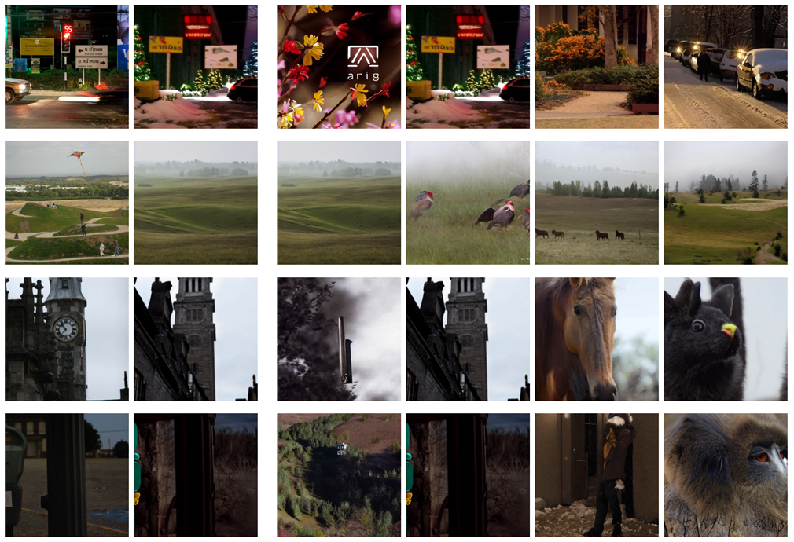
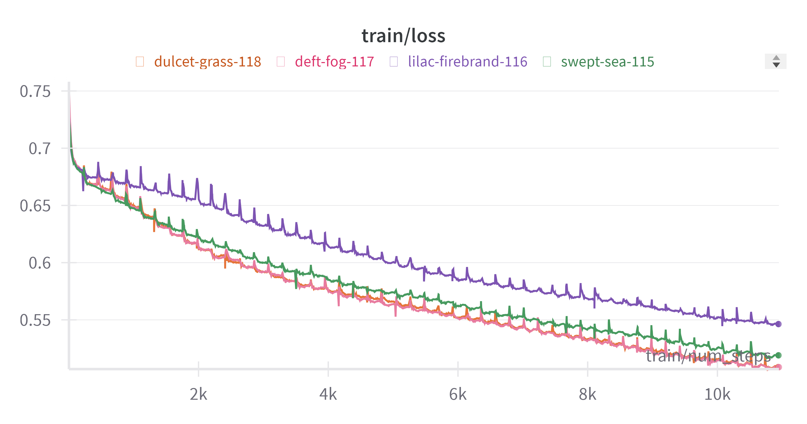
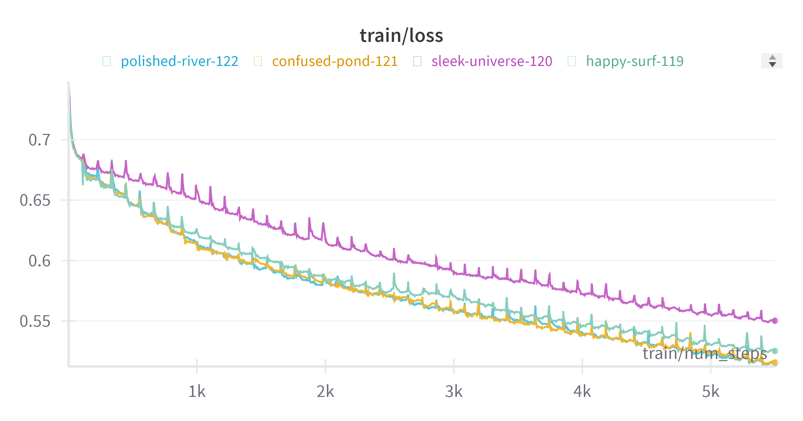
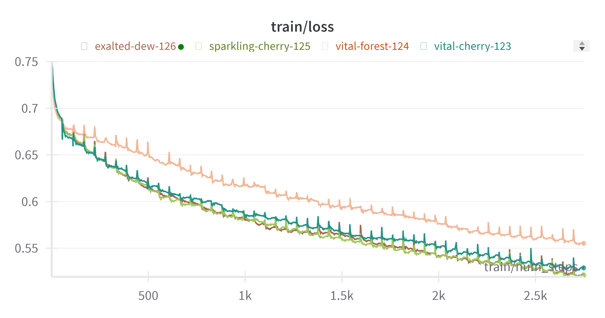

# 2023 Machine Learning Final Project

## Introduction

In this project, we aim to transform fMRI vetcors into images that the subject was looking at.

We build this model by VAE, BLIP, Stable Diffusion and CLIP.

## Architecture


> The architecture of our model.


Our model architecture has three parts
- Low-level Pipeline
- Guided Reconstruction Pipeline
- CLIP Voting Pipeline

From Low-level Pipeline, we can retreive low-level feature by making fMRI vectors transformed to VAE latents.

After get the low-level images, we then generate high level image by Diffusion(Guided Reconstruction Pipeline). This pipeline including prompts generation by BLIP and generate images by Stable Diffusion.

We train several models base on the architecture described above, then use bagging technich on those models. Calculate similarity by projecting images to CLIP space, then calculating the Cosine Similarity.

Finally, we get the result generate by our model.

## Dataset

From TA, a subset of NSD dataset.

There are 8 subjects' data within this dataset. For each subject, we have fMRI data and corresponding images.

> [Google Drive Link to Dataset](https://drive.google.com/drive/folders/1KQXGIKlS9nu6mLwd13HmKYFv3GsAxXLK?usp=sharing)

## Installation

1. Install Python packages
    ```bash
    pip3 install -r requirements.txt
    ```
2. Download dataset from Google Drive
    
    Place the folder in project root directory. Make sure the name is `dataset`.
    > [Google Drive Link to Dataset](https://drive.google.com/drive/folders/1KQXGIKlS9nu6mLwd13HmKYFv3GsAxXLK?usp=sharing)

    The file `dataset/subj01/training_split/fMRI_VAE.npy` is the preprocessed file. We manually transform training images in subject 1 into VAE latents, **But not for other subjects**.
    If you hope to use other subject's data, then you should generate before by yourself.
3. Make sure you have `Models/`, `results/` in project root directory

## General Information

All codes are in `src/` directory.
- `TrainLowLevel.ipynb`
  
    Code for training low-level pipeline.
- `TrainLowLevel_Modular.ipynb`
  
    Code for training low-level pipeline by Mojo.
- `utils.py`
  
    Some utilities use in this project.
- `Models.py`

    Definition of low-level pipeline model and Dataset class definition.
- `CLIP_bagging.ipynb`

    Including `Guided Reconstruction Pipeline` and `CLIP Voting Pipeline`, to generate training results.
- `Experiments`

    Including 3 experiments and one code for generate low-level results for report.

    - `Experiment1.ipynb`
        Train multiple models with different hyperparameters. This file is essentially a copy of `TraininLowLevel.ipynb`, and we run it multiple times with different hyperparameters, we did not just run it once.
    - `Experiment2.ipynb`
        Evaluate average loss on both training set and validation for the 4 models in CLIP Voting.
    - `Experiment3.ipynb`
        Evaluate average similarity between predicted image generate after the Guided Reconstruction Pipeline for the 4 models in CLIP Voting.
    - `LowLevelReconstruct.ipynb`
        Generate low-level image from the model after the VAE decoder.

All trained low-level pipeline models should be place in `Models/`.

While runnign `CLIP_baggin.ipynb`, the generated images should be place in `results/`.

Some codes that were deprecated are place in `deprecated/` directory.

## Docker

We also provide a dockerfile to create the training environment easily.

1. Clone this project.
2. Downlaod dataset from google drive, place in project root directory and make sure the name is `dataset`.
3. Make sure you have `Models/` and `results/` folder right under the project root directory.
4. Pull the ubuntu image
    ```bash
    sudo docker pull ubuntu:jammy
    ```
5. Create container from dockerfile
    ```bash
    sudo docker build -t <container name> . --no-cache
    ```
6. Run the container
    ```bash
    sudo docker run -p 8888:8888 -it final-project /bin/bash
    ```

Then you are able to run our code without worry about the envirenment issues!

Note that although we have set port forwarding on port `8888`, but that is listening on `0.0.0.0`, not `localhost`, while jupyter notebook will run on `localhost` by default. So make sure if you're running jupyter notebook, add an argument `-ip 0.0.0.0` to indicate which ip to listen on.

## Train the model

To train a model by yourself, you should first make sure.
1. You have `Models/` and `results/` folder right under the project root directory.
2. You have `dataset/` folder with all data inside.
3. You have installed the python packages.

In this implementation, the only model need to be train is Low-level Pipeline, therefore you just need to run codes in `src/TrainLowLevel.ipynb`.

You may modify the hyperparameters in `[Hyperparameters]` section.

To resume training from previous pkt, uncomment `[Resume Training from Pretrained Model]` section, and modify the model path.

## Run Prediction



To predict a fMRI latent or a dataset, you should run codes in `src/CLIP_bagging.ipynb`.

To use your own models, you should modify the `model_paths` in `GetPredictions` function, also modify the corresponding ROI Mask number corresponding to the model in `select_ROIs`.

We generate result in `[Bagging Process]` section. The `i` in for loop indicate the real image code number. If you want to predict different data, then you shall modify the range here.

## Performance

### Experiment 1

From the `Experiment 1`, we plot the training loss curve for the models with different hyperparameters. Below is the environment setup.

- `batch_size` 64
- `num_epochs` 50
- `num_train` 5000
- `lr_scheduler` 'cycle'
- `initial_lr` 1e-4
- `max_lr` 5e-4
- `random_seed` 42

| Model / Hyperparameters | ROI Mask set | Batch Size |
|:---:|:---:|:---:|
| swept-sea-115 | 1 | 16 |
| lilac-firebrand-116 | 2 | 16 |
| deft-fog-117 | 3 | 16 |
| dulcet-grass-118 | - | 16 |
| happy-surf-119 | 1 | 32 |
| sleek-universe-120 | 2 | 32 |
| confused-pond-121 | 3 | 32 |
| polished-river-122 | - | 32 |
| vital-cherry-123 | 1 | 64 |
| vital-forest-124 | 2 | 64 |
| sparkling-cherry-125 | 3 | 64 |
| exalted-dew-126 | - | 64 |

And we have the relation plot as below.





ROI-masked data do not always have higher performance compared with the original one. However, we believe that with different ROI-masked data, different models can bring different perspectives, and thus should do better compared with those simply trained on unmodified ones.

### Experiment 2

From the `Experiment 2`, we evaluate the average loss on both training and validation set for the four models in CLIP Voting. (Model 92, 94, 97, and 100).

| | Model 92 | Model 94 | Model 97 | Model 100 |
|:---:|:---:|:---:|:---:|:---:|
| Average Training Loss | 0.39894207337 | 0.39130232659 | 0.40285292484 | 0.37066267675 |
| Average Validation Loss | 0.64835910251 | 0.65969408800 | 0.64921267331 | 0.65896361570 |

 The model works well on the training set (average loss < 0.41), but the averages on the validation set, on the other hand, are all above 0.6, which is a relatively high loss. We may conclude that our model is overfitting on the training set.

### Experiment 3

From the `Experiment 3`, we evaluate the average cosine similarity on both training and validation set for the four models in CLIP Voting. (Model 92, 94, 97, and 100).

| | Model 92 | Model 94 | Model 97 | Model 100 |
|:---:|:---:|:---:|:---:|:---:|
| Average Training Similarity | 0.561328125 | 0.559260254 | 0.557570801 | 0.558991699 |
| Average Validation Similarity | 0.526516113 | 0.531809082 | 0.535888672 | 0.534655762 |

The models all have an average similarity above 0.5 for both the training set and the validation set. Also, the average similarity difference between the training set and the validation set is small (<0.035). Based on these observations, we may conclude that our models perform well on average.